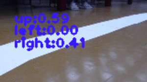

# Self-Driving Pi Car 

[](https://travis-ci.org/felipessalvatore/self_driving_pi_car)
[](https://github.com/felipessalvatore/self_driving_pi_car/blob/master/LICENSE)

## Introduction

Self-Driving Pi Car is a deep neural network based self-driving car, that combines Lego Mindstorms NXT with the computational power of a Raspberry Pi 3.

This repository was created by [Paula Moraes](https://github.com/paulaksm) and [Felipe Salvatore](https://github.com/felipessalvatore).

<p align = 'center'>

</p>
<p align = 'center'>
Robot driving on a track
</p>

You can read more about the project on [Medium](https://medium.com/@project_m/self-drives-me-crazy-from-0-to-self-driving-car-in-150-hours-bf4f68d50d8a)

## Getting Started

### Install

The first thing you need to do is to install all the libraries for the Raspberry Pi. To do so, open a terminal in Raspberry Pi and run:

```
$ cd raspi_utils/
$ bash install.sh
```

In the computer that you will perform the training -- protip: don't train the model in the Raspberry Pi! -- install all the requirements by runnig:

```
$ pip install -r requirements.txt
```

## Usage

**Attention:**
in the master branch all python code is written for Python 2. If you would like to run this project in Python 3, please switch to the python3 branch of this repository.


### Collecting data

Before doing any kind of training you need to collect the track data. So in the Raspberry Pi -- with the assembled robot -- run the data collection script:
```
  $ cd self_driving/data_collection/ 
  $ python DataCollector.py -n <images_folder_name>
```

Pressing `q` will stop execution and save all images and pickle file.

Inside the folder `<images_folder_name>` there will be subdirectories organized by timestamps similar to `2018-02-17-23-27-02` with the collected `*.png` images. All the associated labels are saved in a pickle file `2018-02-17-23-27-02_pickle` in `<images_folder_name>`.

Compress `<images_folder_name>` directory and export it from Raspberry Pi to other computer (using scp command, cloud, email, etc).
```
  $ tar cvf <images_folder_name>.tar <images_folder_name>
```


**Attention:**
please continue following the instructions in the computer that will be use for training.


### Generating npy and tfrecords

Before generating tfrecords, you need to transform the untar `<images_folder_name>` containing all folders of images and pickles into a tuple of np.arrays. Running the following script will result in the creation of `<npy_files_name>_90_160_3_data.npy` and `<npy_files_name>_90_160_3_labels.npy` files:
```
  $ cd self_driving/data_manipulation/
  $ python img2array.py <images_folder_path> <npy_folder_path> <npy_files_name>
```

To generate tfrecords from `*.npy` and augment or manipulate (e.g. binarize) the data, run:
 ```
  $ cd ../ml_training/ 
  $ python generate_tfrecords.py <npy_data_path> <npy_labels_path> -n <name_tfrecords> 
```

Resulting in `<name_tfrecords>_train.tfrecords`, `<name_tfrecords>_test.tfrecords` and `<name_tfrecords>_valid.tfrecords` files.


### Hyperparameters optimization

**Attention:**
all code in this section can be runned on both Python 2 and 3 with TensorFlow 1.2.1 (and above) and with GPU support, if possible.

Now it's time to test different architectures, learning rates and optimizers, in the hopes of improving accuracy. 


#### Best architecture search

Running the following script will create `architecture_results.txt` file with the results for a given configuration passed through optional arguments.
 ```
  $ python best_architecture.py -n <name_tfrecords>
```


#### Best learning rate search

Running the following script will create `learning_rate_results.txt` file with the results for a given configuration passed through optional arguments.
 ```
  $ python best_learning_rate.py -n <name_tfrecords>
```


#### Best optimizer search

Running the following script will create `optimizer_results.txt` file with the results for a given configuration passed through optional arguments.
 ```
  $ python best_optimizer.py -n <name_tfrecords>
```


### Training the model 

**Attention:**
back to Python 2

After searching for an appropriate combination of hyperparameters, you must train the model running this script with additional arguments relative to the model:

```
  $ python train.py -n <name_tfrecords> -v
```

The result will be a `checkpoints` directory with all files needed to deploy the model.


#### Accuracy test

You can test for accuracy with the script:

```
  $ python acc_test.py -n <name_tfrecords>
```


#### Simulation

Before going live, it's possible to simulate the model in action with track images. This simulation script uses `checkpoints` and `<images_folder_path>` to generate new images, saved on `<output_images_folder_path>`, with a stamp of the probabilities for each class.

```
  $ cd ../
  $ python simulation.py <images_folder_path> <output_images_folder_path>
```

Example:
<p align = 'left'>

</p>


### Self-driving 

**Attention:**
this section must be run on Raspberry Pi.

After training the model and loading its `checkpoints` to Raspberry Pi, there will be two modes available: **regular** and **debug**. 

On ___regular mode___, the car will take an action based on the model's prediction given an image took by the camera. Pressing `q` will stop the execution:

```
$ python DiffController.py 
```

The __debug mode__ works in the same way as regular, but also creates a `debug-run` directory containing all images taken during execution with a stamp of the probabilities for each class. Pressing `q` will stop the execution:

```
$ python DiffController.py -d
```


### Running the tests

There is two kind of tests: the ones from the Raspberry Pi and the ones for the training computer.
In the Raspberry Pi run

```
$ python setup.py test 
```
These tests serve to check if the conection with the NXT robot is working.

And in the training computer
```
  $ bash test_script.sh 
```
These last tests check if the image manipulation functions and the tensorflow model are doing what they suppose to be doing.


## Built With

* [Tensorflow](https://www.tensorflow.org/)
* [NXT-Python](https://github.com/Eelviny/nxt-python)


### Citation
```
  @misc{self_driving_pi_car2018,
    author = {Paula Moraes and Felipe Salvatore},
    title = {Self-Driving Pi Car},
    year = {2018},
    howpublished = {\url{https://github.com/felipessalvatore/self_driving_pi_car}},
    note = {commit xxxxxxx}
  }
```
